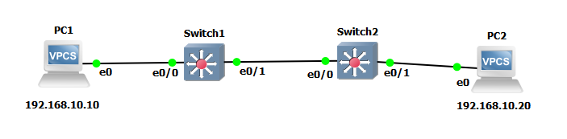

`Switch1>show mac address-table`
```
          Mac Address Table
-------------------------------------------

Vlan    Mac Address       Type        Ports
----    -----------       --------    -----
```
`MAC table` of `Switch1` is empty

`PC1> ip 192.168.10.10/24 192.168.10.1`
```
Checking for duplicate address...
PC1 : 192.168.10.10 255.255.255.0 gateway 192.168.10.1
```

`PC1> arp`
```
arp table is empty
```

`PC2> ip 192.168.10.20/24 192.168.10.1`
```
Checking for duplicate address...
PC1 : 192.168.10.20 255.255.255.0 gateway 192.168.10.1
```

`Switch1>show mac address-table`
```
          Mac Address Table
-------------------------------------------

Vlan    Mac Address       Type        Ports
----    -----------       --------    -----
   1    0050.7966.6800    DYNAMIC     Et0/0
   1    0050.7966.6801    DYNAMIC     Et0/1
   1    aabb.cc00.0200    DYNAMIC     Et0/1
Total Mac Addresses for this criterion: 3
```
I have NO idea what "`aabb.cc00.0200`" is
other 2 are artefacts after "Checking for duplicate address..."

`Switch1#clear mac address-table dynamic`
`Switch1#show mac address-table`
```
          Mac Address Table
-------------------------------------------

Vlan    Mac Address       Type        Ports
----    -----------       --------    -----
   1    aabb.cc00.0200    DYNAMIC     Et0/1
Total Mac Addresses for this criterion: 1
```
it survieved dynamic entries cleance! Wierd

