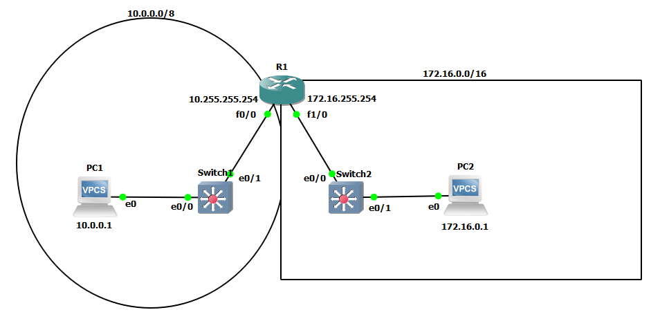

what we want

#### Router configuration
##### f0/0 interface
```
R1>show ip interface brief
Interface                  IP-Address      OK? Method Status                Protocol
FastEthernet0/0            unassigned      YES unset  administratively down down
FastEthernet1/0            unassigned      YES unset  administratively down down
R1>en
Password:
R1#conf t
Enter configuration commands, one per line.  End with CNTL/Z.
R1(config)#interface FastEthernet 0/0
R1(config-if)#ip address 10.255.255.254 ?
  A.B.C.D  IP subnet mask

R1(config-if)#ip address 10.255.255.254 255.0.0.0
R1(config-if)#no shutdown
R1(config-if)#
*Sep 26 18:37:14.203: %LINK-3-UPDOWN: Interface FastEthernet0/0, changed state to up      ---> Layer 1 status change
*Sep 26 18:37:15.203: %LINEPROTO-5-UPDOWN: Line protocol on Interface FastEthernet0/0, changed state to up   ---> Layer 2 status change
R1(config-if)#do show ip interface brief
Interface                  IP-Address      OK? Method Status                Protocol
FastEthernet0/0            10.255.255.254  YES manual up                    up
FastEthernet1/0            unassigned      YES unset  administratively down down
```
##### f1/0 interface
```
R1(config-if)#interface FastEthernet1/0
R1(config-if)#ip address 172.16.255.254 255.255.0.0
R1(config-if)#no shutdown
R1(config-if)#
*Sep 26 18:58:35.479: %LINK-3-UPDOWN: Interface FastEthernet1/0, changed state to up
*Sep 26 18:58:36.479: %LINEPROTO-5-UPDOWN: Line protocol on Interface FastEthernet1/0, changed state to up
R1(config-if)#show ip interface brief
                ^
% Invalid input detected at '^' marker.

R1(config-if)#do show ip interface brief
Interface                  IP-Address      OK? Method Status                Protocol
FastEthernet0/0            10.255.255.254  YES manual up                    up
FastEthernet1/0            172.16.255.254  YES manual up                    up
```

#### VPCS1
```
PC1> show ip

NAME        : PC1[1]
IP/MASK     : 0.0.0.0/0
GATEWAY     : 0.0.0.0
DNS         :
MAC         : 00:50:79:66:68:00
LPORT       : 10002
RHOST:PORT  : 127.0.0.1:10003
MTU:        : 1500

PC1> ip 10.0.0.2/8 10.255.255.254
Checking for duplicate address...
PC1 : 10.0.0.2 255.0.0.0 gateway 10.255.255.254
PC1> show ip

NAME        : PC1[1]
IP/MASK     : 10.0.0.2/8
GATEWAY     : 10.255.255.254
DNS         :
MAC         : 00:50:79:66:68:00
LPORT       : 10002
RHOST:PORT  : 127.0.0.1:10003
MTU:        : 1500
```

#### VPCS2
```
PC2> ip 172.16.0.1/16 172.16.255.254
Checking for duplicate address...
PC1 : 172.16.0.1 255.255.0.0 gateway 172.16.255.254
PC2> show ip

NAME        : PC2[1]
IP/MASK     : 172.16.0.1/16
GATEWAY     : 172.16.255.254
DNS         :
MAC         : 00:50:79:66:68:01
LPORT       : 10004
RHOST:PORT  : 127.0.0.1:10005
MTU:        : 1500
```
#### Switches MAC address table & duplex error
```
Switch1>show mac address-table
          Mac Address Table
-------------------------------------------

Vlan    Mac Address       Type        Ports
----    -----------       --------    -----
   1    0050.7966.6800    DYNAMIC     Et0/0   ---> VPCS
   1    ca01.0759.0000    DYNAMIC     Et0/1   ---> router's f0/0 interface
Total Mac Addresses for this criterion: 2
```
MAC addresses dynamically learned from checking for duplicate addresses.

The same should be in `Switch2`

```
Switch2>show mac address-table
          Mac Address Table
-------------------------------------------

Vlan    Mac Address       Type        Ports
----    -----------       --------    -----
   1    0050.7966.6801    DYNAMIC     Et0/1   ---> VPCS
   1    ca01.0759.001c    DYNAMIC     Et0/0   ---> router's f1/0 interface
Total Mac Addresses for this criterion: 2
```

I just realised `Switch2` gives error:
```
Switch2#
*Sep 26 20:13:27.239: %CDP-4-DUPLEX_MISMATCH: duplex mismatch discovered on Ethernet1/0 (not full duplex), with R1 FastEthernet1/0 (full duplex).
```

let's try to correct it on `Switch2` via `conf t` -> `interface Ethernet1/0` -> `duplex full`
```
Switch2#configure terminal
Enter configuration commands, one per line.  End with CNTL/Z.
Switch2(config)#interface ethernet1/0
Switch2(config-if)#duplex ?
  auto  Enable AUTO duplex configuration
  full  Force full duplex operation
  half  Force half-duplex operation

Switch2(config-if)#duplex full
Switch2(config-if)#exit
Switch2(config)#exit
Switch2#
*Sep 26 20:30:57.903: %SYS-5-CONFIG_I: Configured from console by console
Switch2#
```

Better^^


#### ping check
```
PC1> ping 172.16.0.1
172.16.0.1 icmp_seq=1 timeout
172.16.0.1 icmp_seq=2 timeout
84 bytes from 172.16.0.1 icmp_seq=3 ttl=63 time=20.362 ms
84 bytes from 172.16.0.1 icmp_seq=4 ttl=63 time=15.056 ms
84 bytes from 172.16.0.1 icmp_seq=5 ttl=63 time=16.250 ms

PC1> arp

ca:01:07:59:00:00  10.255.255.254 expires in 111 seconds

PC1>
```
What is happening:
- PC1 needs MAC of PC2 so as to encapsulate IP packet with eth. header.
  1. If Switch1 don't have that IP-MAC pair in ARP  table:
     ARP request (des. FFFF.FFFF.FFFF) -> broadcast in LAN
  1.  IF Switch1 have IP-MAC pair in ARP table:
	  **FINISH THIIIIIIS**

```
PC2> ping 10.0.0.2
84 bytes from 10.0.0.2 icmp_seq=1 ttl=63 time=22.460 ms
84 bytes from 10.0.0.2 icmp_seq=2 ttl=63 time=17.335 ms
84 bytes from 10.0.0.2 icmp_seq=3 ttl=63 time=22.442 ms

PC2> arp

ca:01:07:59:00:1c  172.16.255.254 expires in 105 seconds

PC2>
```
