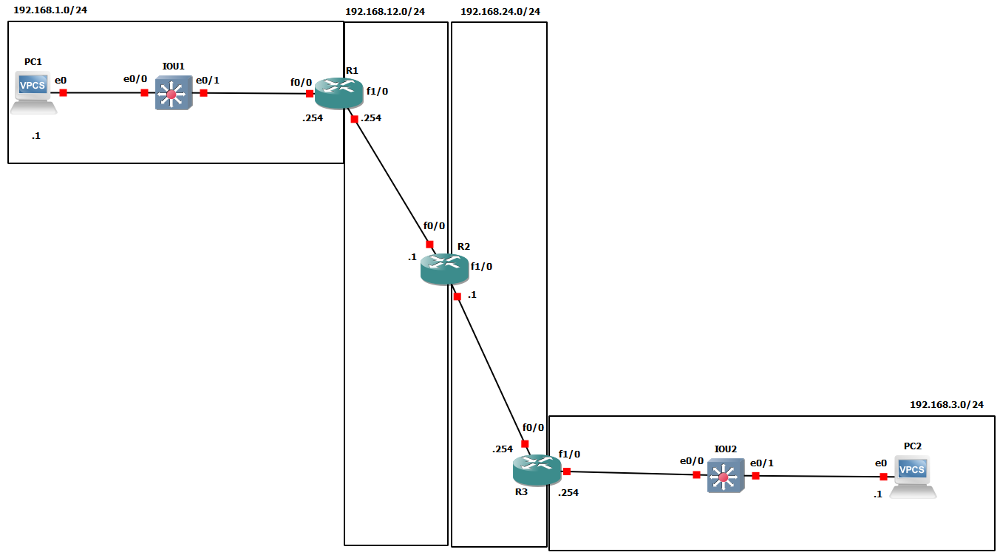

basic configuration of switches,routers & VPCS -> configuring routing tables



### basic
#### VPCS - not working
due to unknown command for setting default gateway
```
PC1> ip 192.168.1.1 255.255.255.0
Checking for duplicate address...
PC1 : 192.168.1.1 255.255.255.0

PC1> show ip

NAME        : PC1[1]
IP/MASK     : 192.168.1.1/24
GATEWAY     : 255.255.255.0
DNS         :
MAC         : 00:50:79:66:68:00
LPORT       : 10002
RHOST:PORT  : 127.0.0.1:10003
MTU:        : 1500
```

```
PC2> ip 192.168.3.1 255.255.255.0
Checking for duplicate address...
PC1 : 192.168.3.1 255.255.255.0

PC2> show ip

NAME        : PC2[1]
IP/MASK     : 192.168.3.1/24
GATEWAY     : 255.255.255.0
DNS         :
MAC         : 00:50:79:66:68:01
LPORT       : 10004
RHOST:PORT  : 127.0.0.1:10005
MTU:        : 1500
```


#### Router-PC (VPCS substitute)
```
PC1#conf t
Enter configuration commands, one per line.  End with CNTL/Z.
PC1(config)#int f0/0
PC1(config-if)#ip address 192.168.1.1 255.255.255.0
PC1(config-if)#no shutdown
PC1(config-if)#duplex full
PC1(config-if)#desc ## I am a PC ##
PC1(config-if)#ip route 0.0.0.0 0.0.0.0 192.168.1.254
```
#### SW1
```
IOU1(config)#hostname SW1
SW1(config)#int range et0/0 - 1
SW1(config-if-range)#int et0/0
SW1(config-if)#desc ## to PC1 ##
SW1(config-if)#int et0/1
SW1(config-if)#desc ## to R1 ##
SW1(config-if)#do show int statu

Port      Name               Status       Vlan       Duplex  Speed Type
Et0/0     ## to PC1 ##       connected    1            auto   auto unknown
Et0/1     ## to R1 ##        connected    1            auto   auto unknown
Et0/2                        connected    1            auto   auto unknown
Et0/3                        connected    1            auto   auto unknown
Et1/0                        connected    1            auto   auto unknown
Et1/1                        connected    1            auto   auto unknown
Et1/2                        connected    1            auto   auto unknown
Et1/3                        connected    1            auto   auto unknown
Et2/0                        connected    1            auto   auto unknown
Et2/1                        connected    1            auto   auto unknown
Et2/2                        connected    1            auto   auto unknown
Et2/3                        connected    1            auto   auto unknown
Et3/0                        connected    1            auto   auto unknown
Et3/1                        connected    1            auto   auto unknown
Et3/2                        connected    1            auto   auto unknown
Et3/3                        connected    1            auto   auto unknown
SW1(config-if)#int range et0/2 - 3, et1/0 - 3, et2/0 - 3, et3/0 - 3
SW1(config-if-range)#shutdown
SW1(config-if-range)#desc
*Dec  7 21:53:45.960: %LINK-5-CHANGED: Interface Ethernet0/2, changed state to administratively down
*Dec  7 21:53:45.960: %LINK-5-CHANGED: Interface Ethernet0/3, changed state to administratively down
*Dec  7 21:53:45.960: %LINK-5-CHANGED: Interface Ethernet1/0, changed state to administratively down
*Dec  7 21:53:45.969: %LINK-5-CHANGED: Interface Ethernet1/1, changed state to administratively down
*Dec  7 21:53:45.969: %LINK-5-CHANGED: Interface Ethernet1/2, changed state to administratively down
*Dec  7 21:53:45.969: %LINK-5-CHANGED: Interface Ethernet1/3, changed state to administratively down
*Dec  7 21:53:45.969: %LINK-5-CHANGED: Interface Ethernet2/0, changed state to administratively down
*Dec  7 21:53:45.973: %LINK-5-CHANGED: Interface Ethernet2/1, changed state to administratively down
*Dec  7 21:53:45.983: %LINK-5-CHANGED: Interface Ethernet2/2, changed state to administratively down
*Dec  7 21:53:45.983: %LINK-5-CHANGED: Interface Ethernet2/3, changed state to administratively down
*Dec  7 21:53:45.983: %LINK-5-CHANGED: Interface Ethernet3/0, changed state to administratively down
*Dec  7 21:53:45.983: %LINK-5-CHANGED: Interface Ethernet3/1, changed state to administratively down
SW1(config-if-range)#desc ##
*Dec  7 21:53:45.994: %LINK-5-CHANGED: Interface Ethernet3/2, changed state to administratively down
*Dec  7 21:53:45.994: %LINK-5-CHANGED: Interface Ethernet3/3, changed state to administratively down
*Dec  7 21:53:46.968: %LINEPROTO-5-UPDOWN: Line protocol on Interface Ethernet0/2, changed state to down
*Dec  7 21:53:46.968: %LINEPROTO-5-UPDOWN: Line protocol on Interface Ethernet0/3, changed state to down
*Dec  7 21:53:46.968: %LINEPROTO-5-UPDOWN: Line protocol on Interface Ethernet1/0, changed state to down
*Dec  7 21:53:46.969: %LINEPROTO-5-UPDOWN: Line protocol on Interface Ethernet1/1, changed state to down
*Dec  7 21:53:46.969: %LINEPROTO-5-UPDOWN: Line protocol on Interface Ethernet1/2, changed state to down
*Dec  7 21:53:46.969: %LINEPROTO-5-UPDOWN: Line protocol on Interface Ethernet1/3, changed state to down
*Dec  7 21:53:46.969: %LINEPROTO-5-UPDOWN: Line protocol on Interface Ethernet2/0, changed state to down
*Dec  7 21:53:46.978: %LINEPROTO-5-UPDOWN: Line protocol on Interface Ethernet2/1, changed state to down
*Dec  7 21:53:46.988: %LINEPROTO-5-UPDOWN: Line protocol on Interface Ethernet2/2, changed state to down
*Dec  7 21:53:46.988: %LINEPROTO-5-UPDOWN: Line protocol on Interface Ethernet2/3, changed state to down
SW1(config-if-range)#desc ## not
*Dec  7 21:53:46.988: %LINEPROTO-5-UPDOWN: Line protocol on Interface Ethernet3/0, changed state to down
*Dec  7 21:53:46.988: %LINEPROTO-5-UPDOWN: Line protocol on Interface Ethernet3/1, changed state to down
*Dec  7 21:53:47.001: %LINEPROTO-5-UPDOWN: Line protocol on Interface Ethernet3/2, changed state to down
*Dec  7 21:53:47.001: %LINEPROTO-5-UPDOWN: Line protocol on Interface Ethernet3/3, changed state to down
SW1(config-if-range)#desc ## not in use ##
SW1(config-if-range)#do show int status

Port      Name               Status       Vlan       Duplex  Speed Type
Et0/0     ## to PC1 ##       connected    1            auto   auto unknown
Et0/1     ## to R1 ##        connected    1            auto   auto unknown
Et0/2     ## not in use ##   disabled     1            auto   auto unknown
Et0/3     ## not in use ##   disabled     1            auto   auto unknown
Et1/0     ## not in use ##   disabled     1            auto   auto unknown
Et1/1     ## not in use ##   disabled     1            auto   auto unknown
Et1/2     ## not in use ##   disabled     1            auto   auto unknown
Et1/3     ## not in use ##   disabled     1            auto   auto unknown
Et2/0     ## not in use ##   disabled     1            auto   auto unknown
Et2/1     ## not in use ##   disabled     1            auto   auto unknown
Et2/2     ## not in use ##   disabled     1            auto   auto unknown
Et2/3     ## not in use ##   disabled     1            auto   auto unknown
Et3/0     ## not in use ##   disabled     1            auto   auto unknown
Et3/1     ## not in use ##   disabled     1            auto   auto unknown
Et3/2     ## not in use ##   disabled     1            auto   auto unknown
Et3/3     ## not in use ##   disabled     1            auto   auto unknown
```

#### R1
```
R1#conf t
Enter configuration commands, one per line.  End with CNTL/Z.
R1(config)#do show ip int brief
Interface                  IP-Address      OK? Method Status                Protocol
FastEthernet0/0            unassigned      YES unset  administratively down down
FastEthernet1/0            unassigned      YES unset  administratively down down
FastEthernet1/1            unassigned      YES unset  administratively down down
Serial2/0                  unassigned      YES unset  administratively down down
Serial2/1                  unassigned      YES unset  administratively down down
Serial2/2                  unassigned      YES unset  administratively down down
Serial2/3                  unassigned      YES unset  administratively down down
R1(config)#do show int desc
Interface                      Status         Protocol Description
Fa0/0                          admin down     down
Fa1/0                          admin down     down
Fa1/1                          admin down     down
Se2/0                          admin down     down
Se2/1                          admin down     down
Se2/2                          admin down     down
Se2/3                          admin down     down
R1(config)#int fa0/0
R1(config-if)#ip address 192.168.1.254 255.255.255.0
R1(config-if)#duplex full
R1(config-if)#speed 100
               ^
% Invalid input detected at '^' marker.

R1(config-if)#duplex full
R1(config-if)#no shutdown
R1(config-if)#desc ####
*Dec  7 21:44:17.675: %LINK-3-UPDOWN: Interface FastEthernet0/0, changed state to up
*Dec  7 21:44:18.675: %LINEPROTO-5-UPDOWN: Line protocol on Interface FastEthernet0/0, changed state to up
R1(config-if)#desc ## to SW 1 ##
R1(config-if)#int f1/0
R1(config-if)#ip address 192.168.12.254 255.255.255.0
R1(config-if)#no shutdown
R1(config-if)#duplex full
R1(config-if)#
*Dec  7 21:44:54.431: %LINK-3-UPDOWN: Interface FastEthernet1/0, changed state to up
R1(config-if)#desc ###
*Dec  7 21:44:57.467: %LINK-3-UPDOWN: Interface FastEthernet1/0, changed state to up
*Dec  7 21:44:58.467: %LINEPROTO-5-UPDOWN: Line protocol on Interface FastEthernet1/0, changed state to up
R1(config-if)#desc ## to R2 ##
R1(config-if)#do show int desc
Interface                      Status         Protocol Description
Fa0/0                          up             up       ## to SW 1 ##
Fa1/0                          up             up       ## to R2 ##
Fa1/1                          admin down     down
Se2/0                          admin down     down
Se2/1                          admin down     down
Se2/2                          admin down     down
Se2/3                          admin down     down
R1(config-if)#int fa0/0
R1(config-if)#desc ## to SW1 ##
R1(config-if)#do show int desc
Interface                      Status         Protocol Description
Fa0/0                          up             up       ## to SW1 ##
Fa1/0                          up             up       ## to R2 ##
Fa1/1                          admin down     down
Se2/0                          admin down     down
Se2/1                          admin down     down
Se2/2                          admin down     down
Se2/3                          admin down     down
R1(config-if)#do write
Building configuration...
[OK]
```


#### R2
```
R2#conf t
Enter configuration commands, one per line.  End with CNTL/Z.
R2(config)#int f0/0
R2(config-if)#ip address 192.168.12.1 255.255.255.0
R2(config-if)#no shutdown
R2(config-if)#duplex fu
*Dec  7 21:51:52.707: %LINK-3-UPDOWN: Interface FastEthernet0/0, changed state to up
*Dec  7 21:51:53.707: %LINEPROTO-5-UPDOWN: Line protocol on Interface FastEthernet0/0, changed state to up
R2(config-if)#duplex full
R2(config-if)#desc ## to R1 ##
R2(config-if)#int f1/0
R2(config-if)#ip address 192.168.24.1 255.255.255.0
R2(config-if)#no shutdown
R2(config-if)#duplex full
R2(config-if)#
*Dec  7 21:52:41.023: %LINK-3-UPDOWN: Interface FastEthernet1/0, changed state to up
R2(config-if)#
*Dec  7 21:52:43.755: %LINK-3-UPDOWN: Interface FastEthernet1/0, changed state to up
*Dec  7 21:52:44.755: %LINEPROTO-5-UPDOWN: Line protocol on Interface FastEthernet1/0, changed state to up
R2(config-if)#desc ## to R3 ##
R2(config-if)#do write
Building configuration...
[OK]

```


#### R3
```
R3#conf t
Enter configuration commands, one per line.  End with CNTL/Z.
R3(config)#int f0/0
R3(config-if)#ip address 192.168.24.254 255.255.255.0
R3(config-if)#no shutdown
R3(config-if)#duplex full
R3(config-if)#
*Dec  7 21:53:24.079: %LINK-3-UPDOWN: Interface FastEthernet0/0, changed state to up
*Dec  7 21:53:25.079: %LINEPROTO-5-UPDOWN: Line protocol on Interface FastEthernet0/0, changed state to up
R3(config-if)#desc ## to R2 ##
R3(config-if)#int f1/0
R3(config-if)#ip address 192.168.3.254 255.255.255.0
R3(config-if)#no shutdown
R3(config-if)#duplex
*Dec  7 21:54:15.843: %LINK-3-UPDOWN: Interface FastEthernet1/0, changed state to up
*Dec  7 21:54:16.843: %LINEPROTO-5-UPDOWN: Line protocol on Interface FastEthernet1/0, changed state to up
R3(config-if)#duplex full
R3(config-if)#
*Dec  7 21:54:18.703: %LINEPROTO-5-UPDOWN: Line protocol on Interface FastEthernet1/0, changed state to down
R3(config-if)#
*Dec  7 21:54:20.707: %LINK-3-UPDOWN: Interface FastEthernet1/0, changed state to up
*Dec  7 21:54:21.707: %LINEPROTO-5-UPDOWN: Line protocol on Interface FastEthernet1/0, changed state to up
R3(config-if)#desc ## to SW2 ##
R3(config-if)#do write
Building configuration...
[OK]
R3(config-if)#do show int desc
Interface                      Status         Protocol Description
Fa0/0                          up             up       ## to R2 ##
Fa1/0                          up             up       ## to SW2 ##
Fa1/1                          admin down     down
Se2/0                          admin down     down
Se2/1                          admin down     down
Se2/2                          admin down     down
Se2/3                          admin down     down
```

#### SW2
```
IOU2#conf t
Enter configuration commands, one per line.  End with CNTL/Z.
IOU2(config)#hostname SW1
SW1(config)#
*Dec  7 22:02:33.022: %CDP-4-DUPLEX_MISMATCH: duplex mismatch discovered on Ethernet0/0 (not full duplex), with R3 FastEthernet1/0 (full duplex).

SW1(config)#int et0/0
SW1(config-if)#duplex full
SW1(config-if)#desc ## to R1 ##
SW1(config-if)#int e0/1
SW1(config-if)#duplex full
SW1(config-if)#desc ## to PC2 ##
SW1(config-if)#do show int status

Port      Name               Status       Vlan       Duplex  Speed Type
Et0/0     ## to R1 ##        connected    1            auto   auto unknown
Et0/1     ## to PC2 ##       connected    1            auto   auto unknown
Et0/2                        connected    1            auto   auto unknown
Et0/3                        connected    1            auto   auto unknown
Et1/0                        connected    1            auto   auto unknown
Et1/1                        connected    1            auto   auto unknown
Et1/2                        connected    1            auto   auto unknown
Et1/3                        connected    1            auto   auto unknown
Et2/0                        connected    1            auto   auto unknown
Et2/1                        connected    1            auto   auto unknown
Et2/2                        connected    1            auto   auto unknown
Et2/3                        connected    1            auto   auto unknown
Et3/0                        connected    1            auto   auto unknown
Et3/1                        connected    1            auto   auto unknown
Et3/2                        connected    1            auto   auto unknown
Et3/3                        connected    1            auto   auto unknown
SW1(config-if)#int et0/2 - 3, et1/0 - 3, et2/0 - 3, et3/0 - 3
                         ^
% Invalid input detected at '^' marker.

SW1(config)#int range et0/2 - 3, et1/0 - 3, et2/0 - 3, et3/0 - 3
SW1(config-if-range)#shutdown
SW1(config-if-range)#desc #
*Dec  7 22:05:05.533: %LINK-5-CHANGED: Interface Ethernet0/2, changed state to administratively down
*Dec  7 22:05:05.533: %LINK-5-CHANGED: Interface Ethernet0/3, changed state to administratively down
*Dec  7 22:05:05.533: %LINK-5-CHANGED: Interface Ethernet1/0, changed state to administratively down
*Dec  7 22:05:05.533: %LINK-5-CHANGED: Interface Ethernet1/1, changed state to administratively down
*Dec  7 22:05:05.546: %LINK-5-CHANGED: Interface Ethernet1/2, changed state to administratively down
*Dec  7 22:05:05.546: %LINK-5-CHANGED: Interface Ethernet1/3, changed state to administratively down
*Dec  7 22:05:05.546: %LINK-5-CHANGED: Interface Ethernet2/0, changed state to administratively down
*Dec  7 22:05:05.546: %LINK-5-CHANGED: Interface Ethernet2/1, changed state to administratively down
*Dec  7 22:05:05.546: %LINK-5-CHANGED: Interface Ethernet2/2, changed state to administratively down
*Dec  7 22:05:05.546: %LINK-5-CHANGED: Interface Ethernet2/3, changed state to administratively down
*Dec  7 22:05:05.550: %LINK-5-CHANGED: Interface Ethernet3/0, changed state to administratively down
*Dec  7 22:05:05.559: %LINK-5-CHANGED: Interface Ethernet3/1, changed state to administratively down
SW1(config-if-range)#desc ###
*Dec  7 22:05:05.559: %LINK-5-CHANGED: Interface Ethernet3/2, changed state to administratively down
*Dec  7 22:05:05.559: %LINK-5-CHANGED: Interface Ethernet3/3, changed state to administratively down
*Dec  7 22:05:06.539: %LINEPROTO-5-UPDOWN: Line protocol on Interface Ethernet0/2, changed state to down
*Dec  7 22:05:06.540: %LINEPROTO-5-UPDOWN: Line protocol on Interface Ethernet0/3, changed state to down
*Dec  7 22:05:06.540: %LINEPROTO-5-UPDOWN: Line protocol on Interface Ethernet1/0, changed state to down
*Dec  7 22:05:06.540: %LINEPROTO-5-UPDOWN: Line protocol on Interface Ethernet1/1, changed state to down
*Dec  7 22:05:06.553: %LINEPROTO-5-UPDOWN: Line protocol on Interface Ethernet1/2, changed state to down
*Dec  7 22:05:06.553: %LINEPROTO-5-UPDOWN: Line protocol on Interface Ethernet1/3, changed state to down
*Dec  7 22:05:06.553: %LINEPROTO-5-UPDOWN: Line protocol on Interface Ethernet2/0, changed state to down
*Dec  7 22:05:06.553: %LINEPROTO-5-UPDOWN: Line protocol on Interface Ethernet2/1, changed state to down
*Dec  7 22:05:06.553: %LINEPROTO-5-UPDOWN: Line protocol on Interface Ethernet2/2, changed state to down
*Dec  7 22:05:06.553: %LINEPROTO-5-UPDOWN: Line protocol on Interface Ethernet2/3, changed state to down
SW1(config-if-range)#desc ####
*Dec  7 22:05:06.553: %LINEPROTO-5-UPDOWN: Line protocol on Interface Ethernet3/0, changed state to down
*Dec  7 22:05:06.567: %LINEPROTO-5-UPDOWN: Line protocol on Interface Ethernet3/1, changed state to down
*Dec  7 22:05:06.568: %LINEPROTO-5-UPDOWN: Line protocol on Interface Ethernet3/2, changed state to down
*Dec  7 22:05:06.568: %LINEPROTO-5-UPDOWN: Line protocol on Interface Ethernet3/3, changed state to down
SW1(config-if-range)#desc ## no use ##
SW1(config-if-range)#do show int status

Port      Name               Status       Vlan       Duplex  Speed Type
Et0/0     ## to R1 ##        connected    1            auto   auto unknown
Et0/1     ## to PC2 ##       connected    1            auto   auto unknown
Et0/2     ## no use ##       disabled     1            auto   auto unknown
Et0/3     ## no use ##       disabled     1            auto   auto unknown
Et1/0     ## no use ##       disabled     1            auto   auto unknown
Et1/1     ## no use ##       disabled     1            auto   auto unknown
Et1/2     ## no use ##       disabled     1            auto   auto unknown
Et1/3     ## no use ##       disabled     1            auto   auto unknown
Et2/0     ## no use ##       disabled     1            auto   auto unknown
Et2/1     ## no use ##       disabled     1            auto   auto unknown
Et2/2     ## no use ##       disabled     1            auto   auto unknown
Et2/3     ## no use ##       disabled     1            auto   auto unknown
Et3/0     ## no use ##       disabled     1            auto   auto unknown
Et3/1     ## no use ##       disabled     1            auto   auto unknown
Et3/2     ## no use ##       disabled     1            auto   auto unknown
Et3/3     ## no use ##       disabled     1            auto   auto unknown
SW1(config-if-range)#do write
```


### routing tables

#### R1
```
R1(config)#do show ip route
Codes: C - connected, S - static, R - RIP, M - mobile, B - BGP
       D - EIGRP, EX - EIGRP external, O - OSPF, IA - OSPF inter area
       N1 - OSPF NSSA external type 1, N2 - OSPF NSSA external type 2
       E1 - OSPF external type 1, E2 - OSPF external type 2
       i - IS-IS, su - IS-IS summary, L1 - IS-IS level-1, L2 - IS-IS level-2
       ia - IS-IS inter area, * - candidate default, U - per-user static route
       o - ODR, P - periodic downloaded static route

Gateway of last resort is not set

C    192.168.12.0/24 is directly connected, FastEthernet1/0
C    192.168.1.0/24 is directly connected, FastEthernet0/0
R1(config)#do show ip int brief
Interface                  IP-Address      OK? Method Status                Protocol
FastEthernet0/0            192.168.1.254   YES manual up                    up
FastEthernet1/0            192.168.12.254  YES manual up                    up
FastEthernet1/1            unassigned      YES unset  administratively down down
Serial2/0                  unassigned      YES unset  administratively down down
Serial2/1                  unassigned      YES unset  administratively down down
Serial2/2                  unassigned      YES unset  administratively down down
Serial2/3                  unassigned      YES unset  administratively down down
R1(config)#do show ip route
Codes: C - connected, S - static, R - RIP, M - mobile, B - BGP
       D - EIGRP, EX - EIGRP external, O - OSPF, IA - OSPF inter area
       N1 - OSPF NSSA external type 1, N2 - OSPF NSSA external type 2
       E1 - OSPF external type 1, E2 - OSPF external type 2
       i - IS-IS, su - IS-IS summary, L1 - IS-IS level-1, L2 - IS-IS level-2
       ia - IS-IS inter area, * - candidate default, U - per-user static route
       o - ODR, P - periodic downloaded static route

Gateway of last resort is not set

C    192.168.12.0/24 is directly connected, FastEthernet1/0
C    192.168.1.0/24 is directly connected, FastEthernet0/0
R1(config)#ip route 192.168.3.0 255.255.255.0 192.168.12.1
R1(config)#do show ip route
Codes: C - connected, S - static, R - RIP, M - mobile, B - BGP
       D - EIGRP, EX - EIGRP external, O - OSPF, IA - OSPF inter area
       N1 - OSPF NSSA external type 1, N2 - OSPF NSSA external type 2
       E1 - OSPF external type 1, E2 - OSPF external type 2
       i - IS-IS, su - IS-IS summary, L1 - IS-IS level-1, L2 - IS-IS level-2
       ia - IS-IS inter area, * - candidate default, U - per-user static route
       o - ODR, P - periodic downloaded static route

Gateway of last resort is not set

C    192.168.12.0/24 is directly connected, FastEthernet1/0
C    192.168.1.0/24 is directly connected, FastEthernet0/0
S    192.168.3.0/24 [1/0] via 192.168.12.1
```

#### R2
```
R2(config)#do show ip int brief
Interface                  IP-Address      OK? Method Status                Protocol
FastEthernet0/0            192.168.12.1    YES manual up                    up
FastEthernet1/0            192.168.24.1    YES manual up                    up
FastEthernet1/1            unassigned      YES unset  administratively down down
Serial2/0                  unassigned      YES unset  administratively down down
Serial2/1                  unassigned      YES unset  administratively down down
Serial2/2                  unassigned      YES unset  administratively down down
Serial2/3                  unassigned      YES unset  administratively down down
R2(config)#ip route 192.168.3.0 255.255.255.0 192.168.24.254
R2(config)#ip route 192.168.1.0 255.255.255.0 192.168.12.254
R2(config)#do show ip route
Codes: C - connected, S - static, R - RIP, M - mobile, B - BGP
       D - EIGRP, EX - EIGRP external, O - OSPF, IA - OSPF inter area
       N1 - OSPF NSSA external type 1, N2 - OSPF NSSA external type 2
       E1 - OSPF external type 1, E2 - OSPF external type 2
       i - IS-IS, su - IS-IS summary, L1 - IS-IS level-1, L2 - IS-IS level-2
       ia - IS-IS inter area, * - candidate default, U - per-user static route
       o - ODR, P - periodic downloaded static route

Gateway of last resort is not set

C    192.168.12.0/24 is directly connected, FastEthernet0/0
C    192.168.24.0/24 is directly connected, FastEthernet1/0
S    192.168.1.0/24 [1/0] via 192.168.12.254
S    192.168.3.0/24 [1/0] via 192.168.24.254
```

#### R3
```
R3(config)#do show ip int brief
Interface                  IP-Address      OK? Method Status                Protocol
FastEthernet0/0            192.168.24.254  YES manual up                    up
FastEthernet1/0            192.168.3.254   YES manual up                    up
FastEthernet1/1            unassigned      YES unset  administratively down down
Serial2/0                  unassigned      YES unset  administratively down down
Serial2/1                  unassigned      YES unset  administratively down down
Serial2/2                  unassigned      YES unset  administratively down down
Serial2/3                  unassigned      YES unset  administratively down down
R3(config)#ip route 192.168.1.0 255.255.255.0 192.168.24.1
R3(config)#do show ip route
Codes: C - connected, S - static, R - RIP, M - mobile, B - BGP
       D - EIGRP, EX - EIGRP external, O - OSPF, IA - OSPF inter area
       N1 - OSPF NSSA external type 1, N2 - OSPF NSSA external type 2
       E1 - OSPF external type 1, E2 - OSPF external type 2
       i - IS-IS, su - IS-IS summary, L1 - IS-IS level-1, L2 - IS-IS level-2
       ia - IS-IS inter area, * - candidate default, U - per-user static route
       o - ODR, P - periodic downloaded static route

Gateway of last resort is not set

C    192.168.24.0/24 is directly connected, FastEthernet0/0
S    192.168.1.0/24 [1/0] via 192.168.24.1
C    192.168.3.0/24 is directly connected, FastEthernet1/0
```


#### route testing
 IMPORTANT - VPCS *need* to know default gateway.
 
 I have no idea how to make them know it

But I can take routers, call em PCs and add them a route `ip route 0.0.0.0 0.0.0.0 gateway_IP` :D

```
PC1#ping 192.168.3.1

Type escape sequence to abort.
Sending 5, 100-byte ICMP Echos to 192.168.3.1, timeout is 2 seconds:
!!!!!
Success rate is 100 percent (5/5), round-trip min/avg/max = 56/94/116 ms

```

knowledge of default gateway is needed, bcos PC has to encapsulate frame with some MAC -> when packet is meant for sth outside LAN it should be encapsulated in frame with default gateway's MAC.